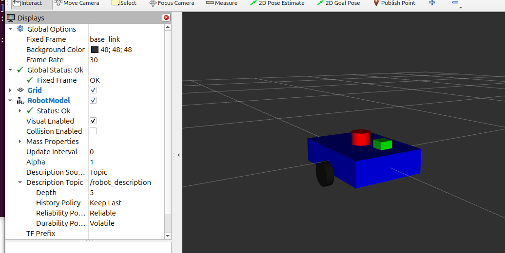
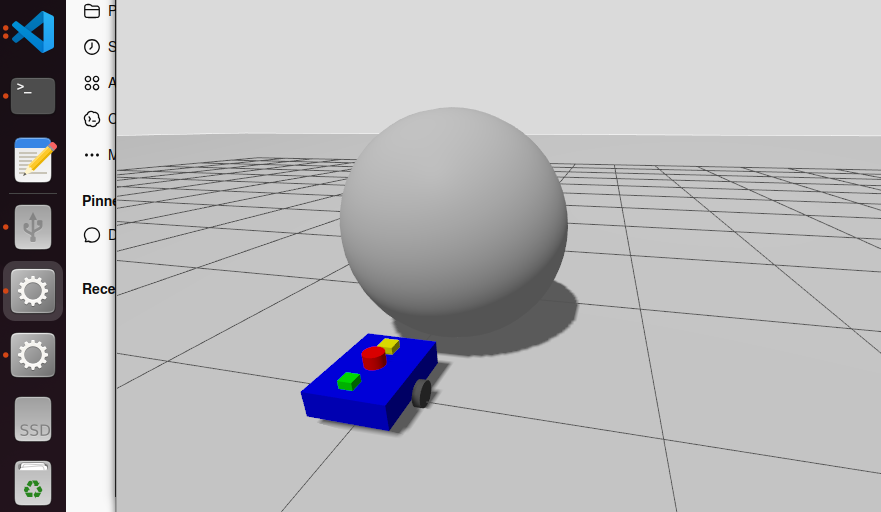
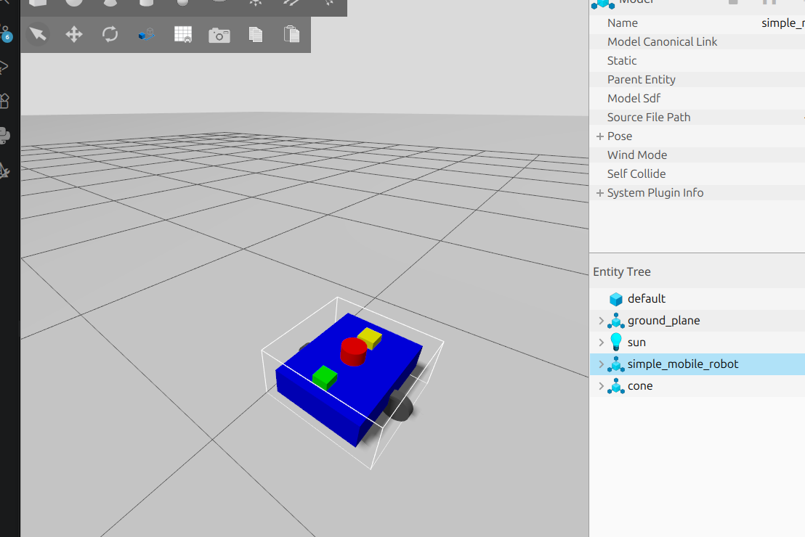
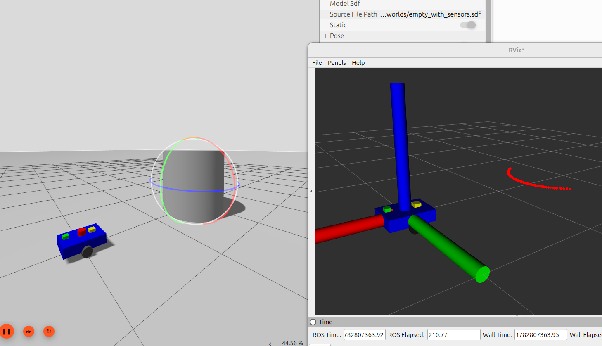
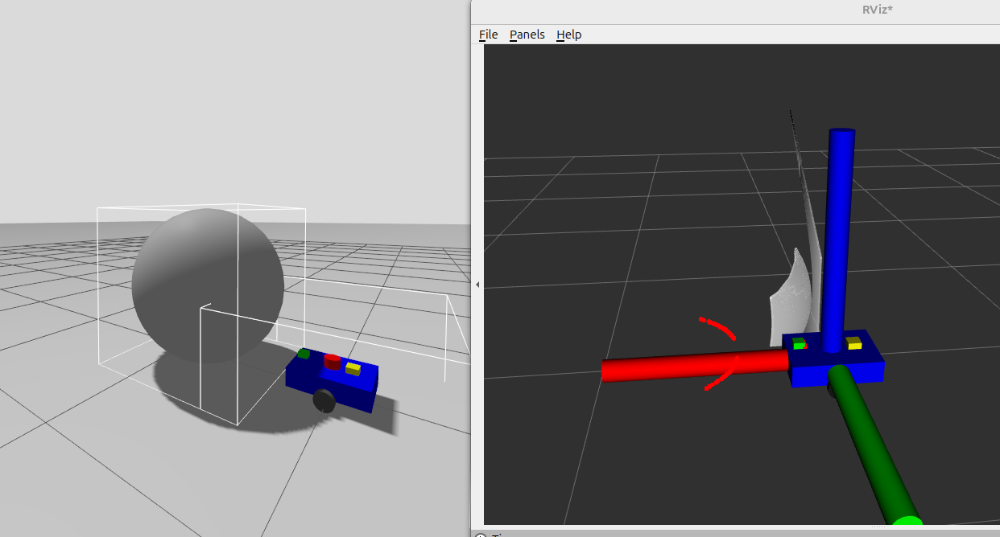
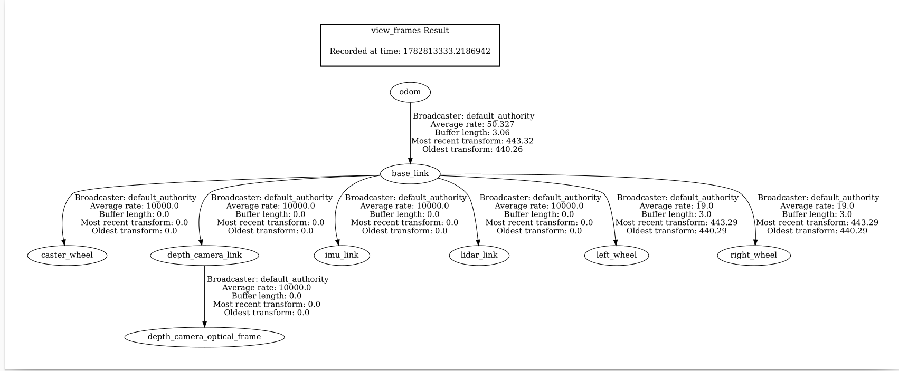

# Simple Mobile Robot (ROS 2 + Gazebo Harmonic)

<p align="center">
  
</p>

A differential-drive mobile robot developed using **ROS 2**, **Gazebo Harmonic**, and **ros2_control**. The robot integrates a **2D GPU LiDAR**, **IMU**, and **RGB-D camera** for perception and visualization. The project demonstrates robot modeling, simulation, sensor integration, and control, providing a foundation for future autonomous navigation and SLAM applications.

---

# Features

- Differential Drive Robot
- ROS 2 Control Integration
- Gazebo Harmonic Simulation
- 2D GPU LiDAR
- IMU Sensor
- RGB-D Camera
- PointCloud2 Generation
- TF Tree
- RViz Visualization
- Odometry Support

---

# Robot Overview

The robot consists of a rectangular mobile base driven by two independently actuated wheels. It is equipped with multiple onboard sensors to perceive its surroundings and publish data to ROS 2 topics.

<p align="center">
  
</p>

---

# Gazebo Simulation

The robot is simulated in Gazebo Harmonic using the **gz_ros2_control** plugin. Differential drive motion is achieved through the `diff_drive_controller`, while all onboard sensors publish real-time data that can be visualized in RViz.

<p align="center">
  
</p>

---

# Differential Drive Controller

The robot uses the **ROS 2 Diff Drive Controller** for velocity control. Commands are published as `TwistStamped` messages, while wheel encoder data is used to estimate odometry.

**Command Topic**

```text
/diff_drive_controller/cmd_vel
```

**Odometry Topic**

```text
/diff_drive_controller/odom
```

<p align="center">
  
</p>

---

# LiDAR

A **2D GPU LiDAR** mounted on top of the robot continuously measures distances to surrounding obstacles. The sensor provides real-time laser scans for visualization and can later be used for mapping and navigation.

**Published Topic**

```text
/scan
```

<p align="center">
  
</p>

---

# IMU

The onboard **Inertial Measurement Unit (IMU)** measures the robot's linear acceleration and angular velocity. This information is useful for localization, sensor fusion, and estimating the robot's motion.

**Published Topic**

```text
/imu
```


---


# Point Cloud

The Depth camera generates a **PointCloud2** representation of the environment, enabling 3D visualization in RViz. This information can later be used for perception, mapping, and obstacle detection.

**Published Topic**

```text
/camera/points
```

<p align="center">
  
</p>

---

# TF Tree

The TF tree defines the spatial relationship between the robot's base frame and all attached sensors. The robot publishes transforms for:

- `odom`
- `base_link`
- `left_wheel`
- `right_wheel`
- `lidar_link`
- `imu_link`
- `depth_camera_link`
- `depth_camera_optical_frame`
- `caster_wheel`

These transforms enable consistent sensor visualization and coordinate transformations throughout the ROS 2 system.

<p align="center">
  
</p>

---

# ROS Topics

| Topic | Message Type | Description |
|--------|--------------|-------------|
| `/scan` | `sensor_msgs/LaserScan` | 2D LiDAR scan |
| `/imu` | `sensor_msgs/Imu` | IMU measurements |
| `/camera` | `sensor_msgs/Image` | RGB image stream |
| `/camera_info` | `sensor_msgs/CameraInfo` | Camera calibration data |
| `/camera/points` | `sensor_msgs/PointCloud2` | 3D point cloud |
| `/joint_states` | `sensor_msgs/JointState` | Wheel joint positions and velocities |
| `/diff_drive_controller/cmd_vel` | `geometry_msgs/TwistStamped` | Velocity command |
| `/diff_drive_controller/odom` | `nav_msgs/Odometry` | Robot odometry |
| `/tf` | `tf2_msgs/TFMessage` | Coordinate frame transforms |
| `/tf_static` | `tf2_msgs/TFMessage` | Static transforms |

---

# Repository Structure

```text
simple_mobile_robot/
│
├── config/
│   └── controllers.yaml
│
├── launch/
│   ├── display.launch.py
│   └── gazebo.launch.py
│
├── urdf/
│   └── simple_robot.urdf.xacro
│
├── worlds/
│
├── meshes/
│
├── images/
│   ├── robot_model.png
│   ├── robot_gazebo.png
│   ├── odom.png
│   ├── LiDAR.png
│   ├── depth_camera.png
│   └──TF_frame.png
│
└── README.md
```

---

# Future Work

This project provides a solid foundation for autonomous mobile robotics. Planned future improvements include:

- Integration with **SLAM Toolbox**
- Autonomous navigation using **Nav2**
- Sensor fusion with **robot_localization**
- Visual perception using the RGB-D camera
- Obstacle avoidance
- Autonomous path planning
- Hardware deployment on a physical robot

---

# Demonstration

The project demonstrates:

- Differential drive motion using **ros2_control**
- Gazebo Harmonic simulation
- LiDAR scan visualization
- IMU integration
- RGB-D camera streaming
- Real-time PointCloud2 generation
- TF tree visualization
- RViz-based sensor visualization

